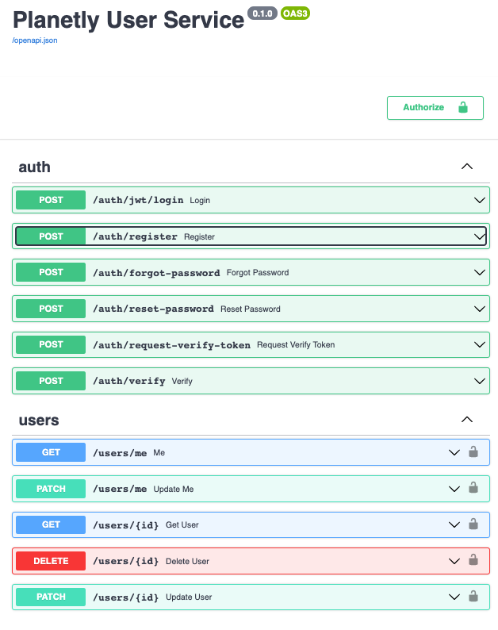
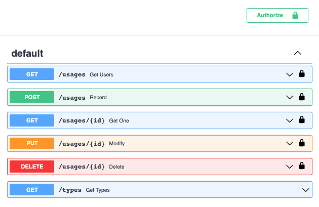

# Planetly Coding Challenge

In this challenge, I demonstrate that writing real (micro) services with FastAPI is possible. I believe that this challenge could have been done with less work in a framework like Flask using restful, restplus or restx or even Django. FastAPI is relatively new and compared to all other flask extension, it is able to generate OpenAPI 3.0 documentation instead of OpenAPI 2.X.  

## Used

This project uses a few 3rd party libraries.

  * [FastAPI](https://github.com/tiangolo/fastapi) as overall web framework.
  * [Pydantic](https://github.com/samuelcolvin/pydantic/) for model validation.
  * [Jose](https://pypi.org/project/python-jose/) for handling JWT in the carbon service.
  * [Motor](https://motor.readthedocs.io/en/stable/) for async database access.


## Project Structure

```
.
├── README.md            < if you are reading this, you are here
├── docker-compose.yml   
├── carbon-api           < frist service that contains usage data
│   ├── Dockerfile
│   ├── README.md
│   ├── api
│   │   ├── __init__.py
│   │   ├── api.py       < endpoins are specified here
│   │   ├── auth.py
│   │   ├── db.py
│   │   ├── errors.py
│   │   └── models.py
│   ├── prime_db.py
│   ├── requirements.txt
│   └── test
│       └── test_api.py  < unittests
└── user-api
    ├── Dockerfile
    ├── api
    │   ├── __init__.py
    │   └── api.py       < this loads the user management service 
    └── requirements.txt

```

# Get it running

In the current docker-compose configuration, both services are exposed to the host on different ports and their Swagger-UI can be accessed on the same machine from

- User-Service: http://localhost:8081/docs
- Carbon-Service: http://localhost:8082/docs


To start the services, run:

```bash
$ docker-compose up
```

Initially, the carbon-database is empty. It should be primed with usage-type data. A quick script (I know, it's hacky but should work for this demonstration) should be run from the project directory:

```
$ python3 ./carbon-api/prime_db.py
[?] Connected to database mongodb://localhost:27017
[*] Adding 5 entries to the collection...
[*]...done
```

# Architecture

The system is split up into two microservices: **User-Service** and **Carbon-Service**. The advantage is, that both services can be run completely independent. They have no connection with each other but share a common secret: The _JWT Secret_. This allows a user to authenticate at the User-Service and authorize at the Carbon service to access her data.

Following common microservice patterns, each service maintains it's own database. I decided to use a Mongodb databse for both services. Due to the structured way the carbon-service data, a relational database would have been a good choice, too.

## CORS policies

One obstacle that had to be accepted is that CORS policies had to be implemented in the User-Service. Otherwise, the authorization for the Swagger UI would not have worked. Of course, with the use of a proper API gateway, this problem cold have been solved easiliy - but I decided that an additional API gateway is out-of-scope for this challenge.

> Cool extra: Carbon-Service's swagger is configured so that an Authorize requests should be sent to the User-Service.

## Before you start, you need a user account

You can register a new user account at the planetly user-service via the `/auth/register` endpoint.


> Note: Of course, for production, this service needs to be hidden behind an API gateway or another facade to "shield" anyone from creating high-privilege accounts.

## What a users can expect from the Carbon Service

As you can see, all endpoins require authorization. A user has only access to their own resources. Creating a new resource takes minimun data: 

### `POST /usages`
Request:
```json
{
  "amount": 1337,
  "usage_type_id": 100
}
```

and you'll get back:

```json
{
  "amount": 1337,
  "user_id": "75a3ba43-bb9a-4a24-8c8f-3ea41cc81fcd",
  "usage_type": {
    "id": 100,
    "name": "electricity",
    "unit": "kwh",
    "factor": 1.5
  },
  "usage_at": "2021-06-11T19:51:03.875000",
  "_id": "60c3bea70b4a1d800dcad099"
}
```

All important CRUD operations are implemented in the API. An unauthorized list endpoint for types exist - Frontend will be happy ;-).




# Final Notes

It was fun working on this challenge. I've probably spend a bit too much time on small details that could have been done easier but I've seen it as a challenge to improve my knowledge in certain areas. This is my second "project" using FastAPI and I hope to see it growing more mature. Some features are still very frustrating and imature where other frameworks just offer more convenience.

*Feedback is always welcome* 

**Cheers,**

  **~[Christoph](github.com/c7h)**